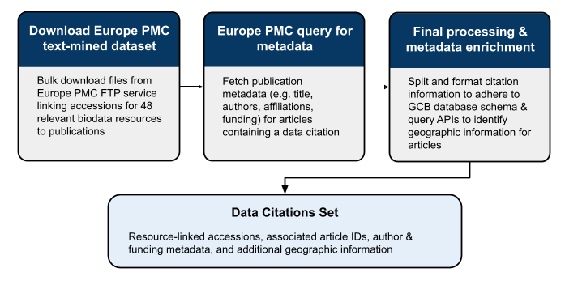

# GBC Accession Loading Workflow

# 🧭 Background

The [Global Biodata Coalition](https://globalbiodata.org) seeks to exchange knowledge and share strategies for supporting biodata resources. To develop an underlying evidence base to show the importance of biodata resources to the life sciences comminity at large, several data analyses were undertaken. All were based on mining published scientific literature, with the help of Europe PMC's APIs.

1. **A global inventory** : The aim here is to identify publications the describe a resources, and form a list of known biodata resources.
2. **Resource mentions** : Here, we wish to capture the usage of these inventory resources by detecting mentions of their names & aliases in open-access full-text articles. This seeks to capture the more informal type of resource citation (outside of official publication references and/or data citations).
3. **Data citations** : Finally, data from these resources can be cited directly by accession number (or other resource-dependent identifier). These are annotated as part of Europe PMC's text-mining service and have been imported into our database as an additional data source.

✅ **This repository holds the workflow used to load Europe PMC's text mined accessions/data citations into the GBC database schema**


# Workflow Summary

This workflow imports **data citations** from Europe PMC into the GBC database.
It identifies publications containing accession-based citations to biodata resources, enriches them with publication metadata, and reformats them to match the GBC database schema.

The workflow runs in three main stages:

1. **Download Europe PMC text-mined dataset**
   Bulk downloads pre-computed files from [Europe PMC’s FTP service](https://europepmc.org/ftp/TextMinedTerms).
   These files link accession identifiers to publications across 48 key biodata resources.

2. **Europe PMC query for metadata**
   Fetches publication metadata (e.g. title, authors, affiliations, funding) for each article containing a data citation.
   Queries the Europe PMC REST API to retrieve and validate this contextual information.

3. **Final processing & metadata enrichment**
   Parses, splits, and formats citation data to conform to the GBC database schema.
   Enriches articles with author and funding metadata, and queries additional APIs (`locationtagger`/`googlemaps`) to identify geographic information.

---

## Workflow Output

- **Data Citations Set**
  A structured dataset containing resource-linked accessions, associated article IDs, author and funding metadata, and geographic enrichment.
  This dataset is imported directly into the GBC database to complement resource mentions and publication records.

---

An overview of the workflow is shown below:


## ⚙️ Setup

#### 1. Clone this repository:
```bash
git clone https://github.com/globalbiodata/gbc-accession-loading.git
cd gbc-accession-loading
```

#### 2. Create and activate the conda environment:
```bash
conda env create -f environment.yml
conda activate gbc-accession-loading
```

To verify, ensure `nextflow` is available on your `PATH`:
```bash
nextflow -version
```

#### 3. Install the core `globalbiodata` modules from the [gbc-publication-analysis](https://github.com/globalbiodata/gbc-publication-analysis) repository:
```bash
git clone https://github.com/globalbiodata/gbc-publication-analysis
export PYTHONPATH=$PWD/gbc-publication-analysis:$PYTHONPATH
```

4. Verify the installation:
```bash
python -m globalbiodata
```

---

## ▶️ Running the Workflow

All configuration is handled via `nextflow.config` and the `conf/` directory.

⚠️ Before running, it is important to create/update some configuration files
- `version.json`  : describes details about the run of the workflow (date, user, etc)
- `db_credentials.json` : provides user credentials for database access

> ✅ Samples can be found in the `conf/` directory

### Basic Local Execution
```bash
nextflow run . -profile production
```

You can specify parameters such as output directory and resource list:
```bash
nextflow run . -profile production \
    --outdir results \
    --db_creds db_credentials.json \
    --version_json version.json
```

| Parameter           | Description                                                         |
|---------------------|---------------------------------------------------------------------|
| `--outdir`          | Directory where output files will be saved                          |
| `--excluded_types`  | Space separated list of accession types to exclude                  |
| `--accession_types` | JSON file containing mapping of accession types to GBC resource IDs |
| `--download_url`    | URL for Europe PMC's text mined accession directory                 |
| `--db_creds`.       | JSON file containing database connection credentials                |
| `--version_json`    | JSON file containing workflow run name/version information          |

Output files will be written to the directory specified by `--outdir`. Logs and intermediate files will be stored in the Nextflow work directory.

---

### Test Run

To perform a quick test run of the workflow:
```bash
nextflow run . -profile test_local
```


